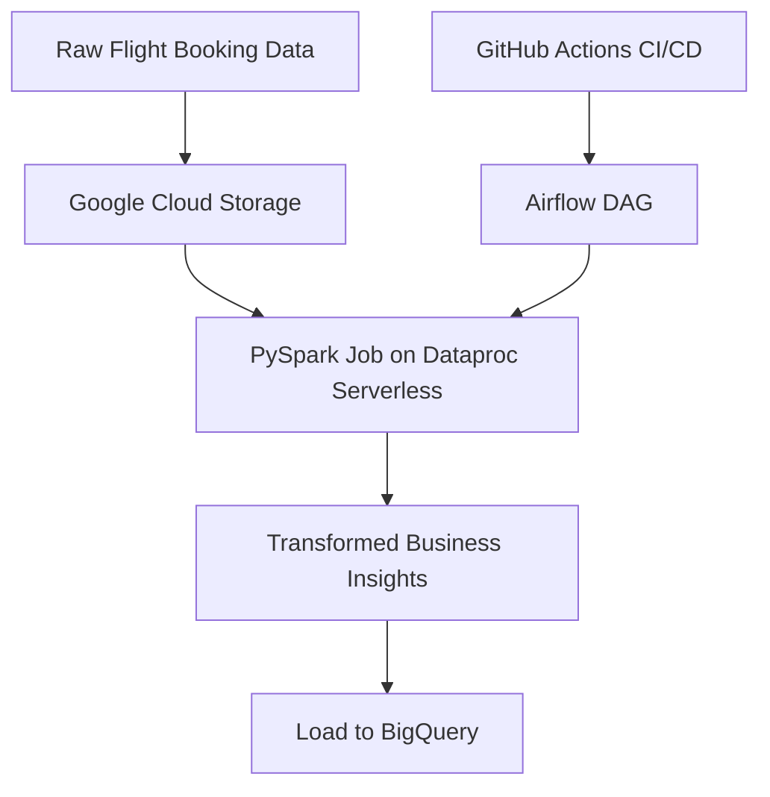

# ✈️ Flight Booking Data Pipeline with Airflow & CI/CD

An end-to-end **data pipeline project** simulating a real-world industrial use case. This system processes flight booking data using **PySpark**, orchestrates the workflow via **Apache Airflow**, deploys on **Dataproc Serverless**, and stores the insights into **BigQuery**. Automated deployments across Dev/Prod environments are managed through **GitHub Actions CI/CD**.

An industrial-grade data pipeline for processing flight booking data at scale. It uses Apache Airflow for workflow orchestration, runs PySpark jobs on Google Cloud Dataproc Serverless for data processing, and loads the results into BigQuery for analytics. Continuous integration and deployment (CI/CD) is implemented via GitHub Actions, enabling automated testing and deployment of pipeline code to development and production environments.

---

## 🚀 Workflow Overview

## 🧱 Folder Structure
Flight-Booking-Data-Pipeline-with-Airflow-CICD/
│
├── dags/                      # Airflow DAG definitions
│   └── flight_booking_dag.py
│
├── jobs/                      # PySpark transformation logic
│   └── flight_transform.py
│
├── scripts/                   # Deployment helper scripts (if any)
│
├── .github/
│   └── workflows/             # GitHub Actions CI/CD configurations
│       └── main.yml
│
├── requirements.txt           # Python dependencies
├── README.md
└── LICENSE

---

## ⚙️ Tech Stack
| Component       | Tool/Service         |
| --------------- | -------------------- |
| Data Processing | PySpark              |
| Orchestration   | Apache Airflow       |
| Infrastructure  | Google Cloud Storage |
| Compute Engine  | Dataproc Serverless  |
| Data Warehouse  | Google BigQuery      |
| CI/CD           | GitHub Actions       |
| Version Control | Git & GitHub         |

---

## 🌟 Key Features
🔁 Automated data pipeline with modular Airflow DAGs

⚡ Serverless Spark jobs for efficient transformation

📊 Business insights stored in BigQuery for easy analysis

🔄 CI/CD workflow for smooth Dev/Prod deployments

☁️ Scalable cloud-native architecture with GCP components

---

## 🔍 Execution Logic
1. Trigger DAG: Airflow DAG is manually or automatically triggered.
2. Run PySpark job: Job is submitted to Dataproc Serverless with input from GCS.
3. Transform data: PySpark cleans, aggregates, and structures booking data.
4. Store results: Output is loaded into specific BigQuery tables.
5. CI/CD pipeline:
   - On push/merge to main or prod, GitHub Actions:
     - Validates code
     - Deploys DAG and PySpark jobs to respective environments

---

## 📦 CI/CD with GitHub Actions
- Triggers on push/merge to main or prod
- Validates code structure
- Deploys PySpark and DAGs to GCS buckets and Composer environment
- Ensures environment-specific configuration is applied correctly

---

## 📈 Business Use Case
This pipeline enables airlines or travel agencies to:
- Analyze flight booking trends
- Detect booking anomalies or peak times
- Monitor operational performance through BigQuery dashboards

